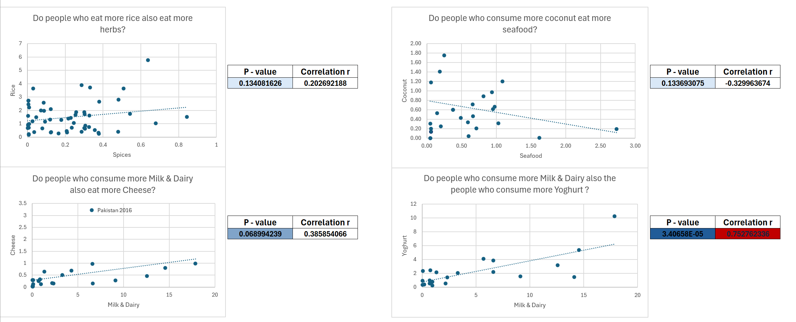

# Food Consumption Analysis 
## Description: Data Analysis of a WHO Food Consumption dataset using Excel and Power BI

## Introduction
I find that it is very important to practice your skills after learning them. On my journey of preparing myself with tools to aid with the process of working with data, Excel and Power BI came as the most rational solutions at the beginning. Indeed, easy to use, understand and manipulate are some advantages of these Microsoft tools. This project's purpose was mostly for self-educational purposes rather than trying to seek data-driven answers.

## Dataset Description:
- Name: CIFOCOss - Chronic individual food consumption database
- Source: <https://apps.who.int/foscollab/Download/DownloadConso>
- Key features: Mean consumption, Gender, Food Groups, Age Groups
- Processing: 
1. Igoring null prone columns
2. Filtering samples with irrelevant/duplicate data

## Tools Used:
- __Microsoft Excel__ with powerful and complete data manipulation, analysis as well as visualisation options
- __Microsoft Power BI__ with a focus on demonstrating _visual_ insights from data models

## Methodology:
- Utilise Power Query to process messy data, creating a cleaner version known as Working Data
- Make good use of Power Pivot to create useful measures and its superior speed and support for Pivot Tables and Charts
- Excel only: 
  1. Advanced Data Analysis tools, specifically Regression and Correlation 
  2. Beginner friendly Custom Data and Interface manipulation
- Power BI only:
  1. Optimized tools developed for Data Visualisation. For instance, automatically showing filters and visualisation stylings.
  2. Convenient synchronised interactions between visuals.

## Key Findings
1. In the age group spanning from 15-74 exists not only a higher percentage of Males consuming Eggs and Meat but also an Average Consumption of these Food Froups of around 2x as much as Females.

  
  

2. Testing for Correlated relationships between Food Groups was not too hard with the help of Analysis ToolPak Add-in, more specifically Regression and Correlation.

 

> [!NOTE] I believe there exists a possible positive correlation between Milk & Dairy and Cheese Consumption, especially with the outlier excluded (Data from Pakistan from 2016). Let's say that I am happy with the tested "hypothesis".

3. My last hypothesis suggests that there might be a negative correlation between how _diverse_ the cuisine is and how much _each_ type of food was consumed in that region (at the time of the survey).

>Although the correlation wasn't exactly __strong__, the relationship was most likely not due to chance.

4. Lastly, an interesting finding which caught me by surprise, being the fact that __Infants & Toddlers__ consumed the __Highest__ Amount of Food among the Age Groups after being __Normalized__ to Bodyweight.

5. Let's not talk about some of the _unexpected_  analyses, such as:
- People who consume more rice don't necessarily consume more herbs
- Coconut Consumption is not positively significantly correlated to Seafood Consumption. Strange, I thought coconut trees are always near the coasts.
- The Population actually consume more __Herbs__ than __Nuts__, I find it somewhat hard to believe since they are both used as sides but nobody snacks on Herbs. This may propose that it _might_ be due to some amount of bias in the data itself. 

## Conclusion
- Excel is all in all the superior application with highly customizable options and provide more powerful tools.
- Power BI _excel_ in creating visual representations showing insights through dashboards with automated functionalities.

## How to use
1. Excel file:
- Right-click a sheet at the lower left corner and choose Unhide the Working Sheets if you really want to get into the weeds.
- Feel free to open Power Query and Power Pivot.

>[!WARNING] Sheets are currently Protected to avoid misuse. From the Ribbon on top, choose Review and then Unprotect Sheet as you wish to edit.

2. Power BI file:
- Again, feel free to play around with Power Query by choosing "Transform Data" in "Home" or the equivalent to Excel's Power Pivot which is the "Table View" (Table icon at the left side) tab itself.
- Directly press on any column,bar or pie to filter data, this interactive "slicer" of Power BI is unique and amazingly user friendly.
- After pressing a visual, the top right corner shows a few buttons:
  1. A few data drilling tools both up and down
  2. Filters
  3. Focus mode
  4. More options (advanced)

